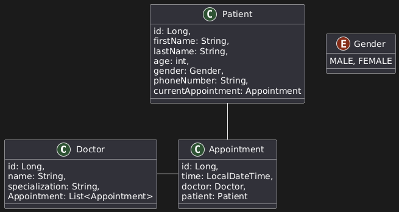

# Doctor Patient Service 

Develop a Doctor Patient REST Service (Doctor, Patient etc) to manage all the basic CRUD operations. 

## Things to implement
- [x] Use Spring Boot as a framework.
- [x] Use Maven as a build and dependency management tool.
- [x] Use H2 in-mem or MySQL database.
- [x] Use Swagger-UI (openapi-UI) for consuming the service.
- [] Implement Testing.
- [] Implement Logging.
- [] Use SonarQube and JaCoCo. 

## Expected Final Result 
1. Should be able to check the data in the requests. 
2. Should be able to make GET, POST, PUT and DELETE database. 
3. Custom exceptions should be thrown if it makes sense. 
4. Input validation should be done wherever it makes sense. 
5. Should return ResponeEntity with appropriate status codes. 

## Entities 

## Expected Entity Relationship 

### Doctor

1. Doctor can be created/retrieved/updated/deleted. 
2. A doctor can have minimum zero patients and maximum 4 patients. 
3. Adding more patients should throw a meaning exception. 

### Patients

1. Patients can be created/retrieved/updated/deleted. 
2. A patient can be created and can exists without attached to any doctor. 
3. A patient can be later attached to any doctor. 
4. A patient can be attached to only one doctor. 
5. A patient can be removed from one doctor and can be attached to another doctor (if the other doctor have less then 4 patients).

### Appointments

1. Appointments can be created/retrieved/updated/deleted.
2. An Appointment can be created, with specifying Patient's details, Doctor details and the time slot.
3. An Appointment can only have one patient and one doctor.
4. If an appointment is cancelled patient details and doctor details should not be removed.
5. Doctor and Patient relationship is maintained via appointment.